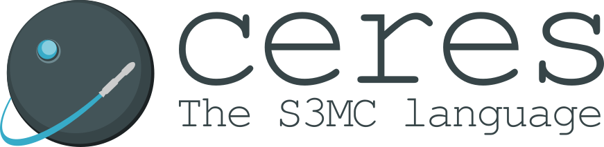

    

# Ceres Documentation
Ceres is a semi-oop simple programming language mainly targeting the S3MC RISC
processor.  
It's main goal is to avoid the use of assembly and machine code during the
development and testing of the S3MC processors. This goal will be gradually
extended to provide a high-level language for newborn RISC processors since LLVM
and other compiler toolchains are relatively hard to work with.

---
## Author

* Author: Gustavo Ale
* GitHub: https://github.com/GustavoAle
* Email: gustavo.engca@gmail.com

## Credits

* Tom Niemann - [Lex & Yacc tutorial](https://www.epaperpress.com/lexandyacc/).
The first versions of the lexer and parser are strongly based on Niemann's
examples presented in the book.
